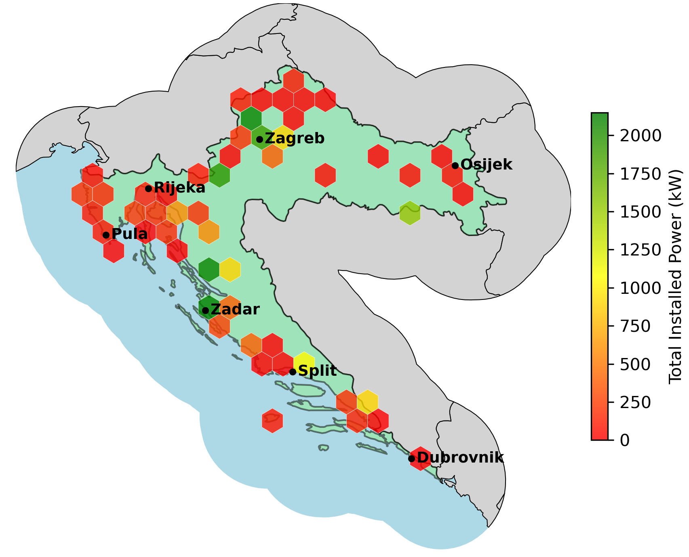
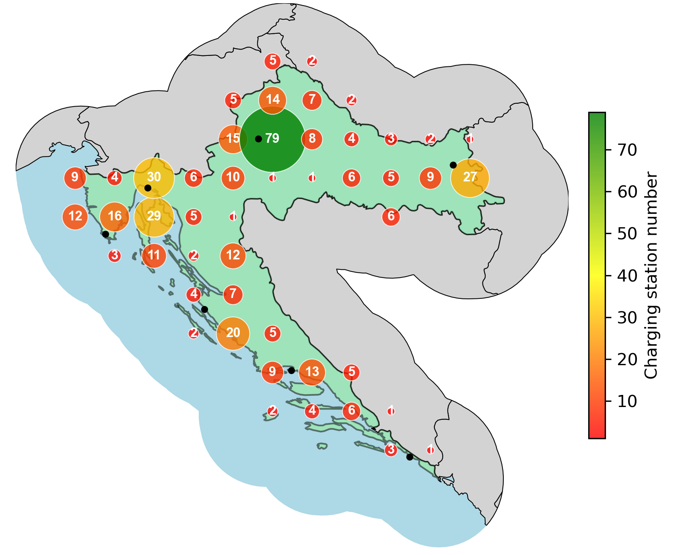

# EV Charging Station Analytics (Croatia) — PySpark + OpenStreetMap (OSM) crowdsourced open dataset

A compact, reproducible pipeline to analyze **EV charging infrastructure in Croatia** from **OpenStreetMap**:
- extract charging stations,
- derive **per‑station total installed power (kW)**, and
- visualize **charger density** and **total installed power**.

> Built as groundwork for similar extraction of **hydrogen refueling** points for my PhD research; none are currently detected in the Croatia extract, but the EV stack is complete and useful on its own.

---

## 🗂️ Current Project Structure

```
.
├── charging_station_analytics/            # (package scaffold, not required to run scripts)
├── open_datasets/
│   └── croatia-latest.osm.pbf            # Geofabrik OSM extract (download separately)
├── output/
│   ├── croatia_charging_stations.parquet
│   └── stations_with_power.parquet/
│       ├── part-*.snappy.parquet
│       └── _SUCCESS
├── scripts/
│   ├── extract_charging_stations.py      # OSM → parquet of charging POIs
│   ├── extract_total_power.py            # parse tags → per‑plug kW, total kW
│   ├── visualize_density.py              # bubble map: station density
│   └── visualize_power.py                # hexbin heatmap: total installed power
├── tests/                                # pytest for extraction/transform/plots
│   ├── test_extraction.py
│   ├── test_transformation.py
│   └── test_visualization.py
├── charging_station_density.png          # 📍 density figure (output)
├── total_installed_power.png             # 🔋 total power figure (output)
├── LICENSE
└── README.md
```
---

## 🚀 Quick Start

```bash
# (Optional) create & activate a virtual environment
python -m venv .venv && source .venv/bin/activate

# Install Python deps
python -m pip install --upgrade pip
python -m pip install pyspark geopandas matplotlib shapely pyrosm pyarrow pytest
# Note: GeoPandas may require system libs (GEOS/PROJ/GDAL) on some OS setups.

# 1) Put the OSM extract here (download from Geofabrik):
#    https://download.geofabrik.de/europe/croatia.html
ls open_datasets/croatia-latest.osm.pbf

# 2) Extract charging stations → Parquet
python scripts/extract_charging_stations.py

# 3) Compute per‑station total power (kW)
python scripts/extract_total_power.py

# 4) Visualize: density (count)
python scripts/visualize_density.py

# 5) Visualize: total installed power (sum of kW)
python scripts/visualize_power.py

# (Optional) run tests
pytest -q
```

Generated figures (by default, saved at repo root):
- **`charging_station_density.png`** — bubble map of station counts.
- **`total_installed_power.png`** — hexbin heatmap of aggregated kW.

---

## 📜 What Each Script Does

### `scripts/extract_charging_stations.py`
- Reads the OSM PBF with **pyrosm**.
- Filters POIs with `amenity=charging_station` (nodes + ways).
- Drops geometry for a lean table and writes **`output/croatia_charging_stations.parquet`** (Arrow Parquet).

### `scripts/extract_total_power.py`
- Loads `output/croatia_charging_stations.parquet` with **PySpark**.
- Parses power‑related tags to estimate **per‑plug power (kW)**, using a conservative “max detected” across available keys:
  - capacity (number of plugs), plus variants like `socket:*:output`, `socket:output`, and fallbacks (e.g., `charging_station:output`, `power` when present).
- Computes:
  - `per_plug_kw` — maximum per‑plug power derived from tags.
  - `total_power_kw` — `capacity × per_plug_kw`.
- Writes a slimmed dataset to **`output/stations_with_power.parquet`** with:  
  `id, lon, lat, capacity, per_plug_kw, total_power_kw, name, operator`.

### `scripts/visualize_density.py`
- Loads stations via **Spark**, converts to **GeoPandas**.
- Uses a ~**100 km buffer** around Croatia for geographic context.
- Bins points to a regular grid and draws a **bubble map** (size ∝ count; red→yellow→green colormap).
- Saves **`charging_station_density.png`**.

### `scripts/visualize_power.py`
- Loads **`output/stations_with_power.parquet`** and clips to the same ~100 km buffer.
- Aggregates **`total_power_kw`** with a **hexbin** map (sum per hex; red→yellow→green colormap).
- Saves **`total_installed_power.png`**.

---

## 🔋 Total Installed Power



---

## 📍 Charging Station Density



## 🧠 Observations (from this dataset)

---

1. **Major corridors are well served.** The Zagreb–Karlovac–Rijeka axis and coastal cities (Zadar, Split) show both high density and high total kW.
2. **Eastern/inland gaps.** Parts of Slavonia remain comparatively underserved.
3. **Single‑site dominance.** Some areas show large total kW contributed by a single high‑output site—good headline numbers, weaker resilience.
4. **Tourist belt emphasis.** Adriatic coverage aligns with seasonal demand along the coast.
---

## 📦 Data Source

- **OpenStreetMap** (via Geofabrik extract):  
  https://download.geofabrik.de/europe/croatia.html

> Data completeness and tagging quality vary by region/operator.

---

## 🧪 Testing

Run the lightweight tests:

```bash
pytest -q
```

They sanity‑check extraction, transformation (power derivation), and plotting routines.

---

## 🔭 Next Steps

- Generalize the pipeline to **any country/region** (select a Geofabrik extract).
- Operator/brand‑level aggregations and basic reliability heuristics.
- **Hydrogen refueling** extraction using OSM tags with similar visuals.

---

## 📄 License

MIT — see [LICENSE](LICENSE).
