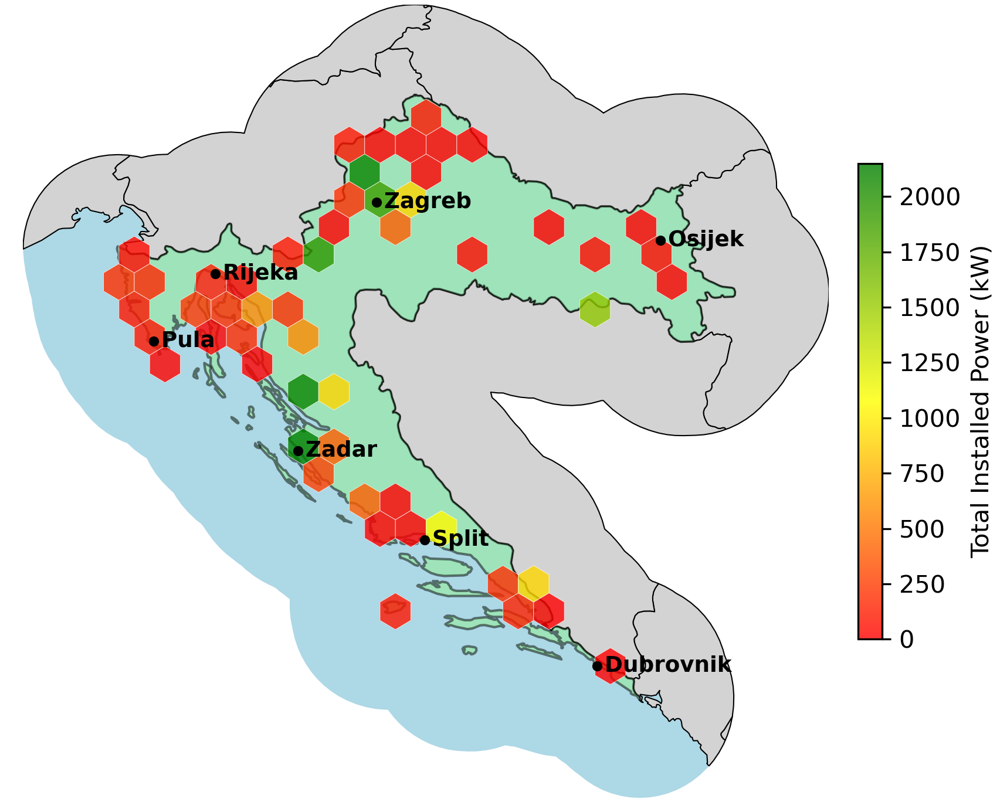
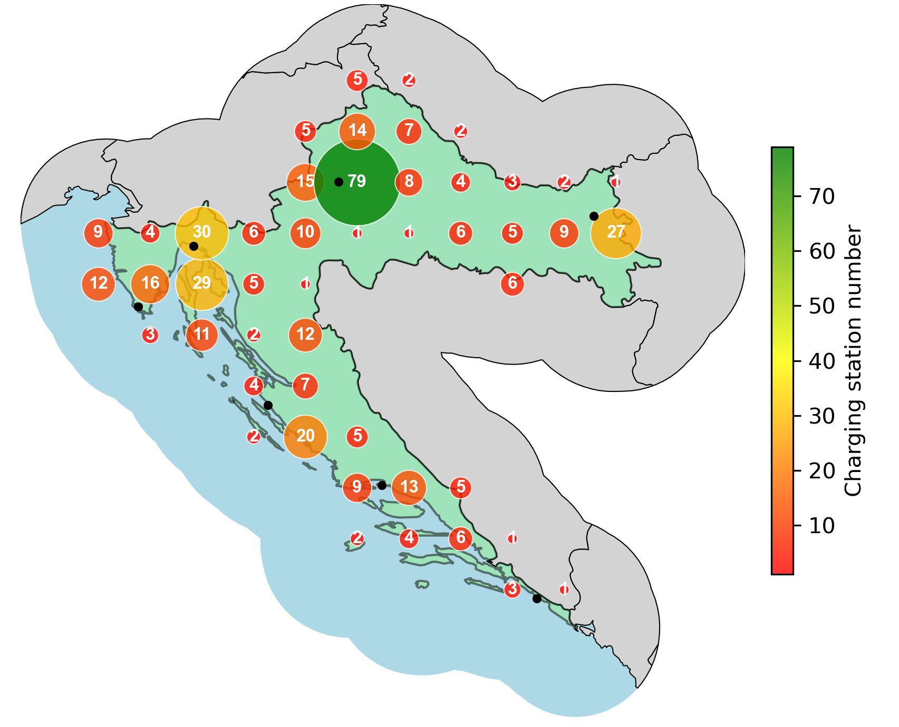

# EV Charging Station Analytics (Croatia)

This repository contains PySpark and GeoPandas-based analysis of electric vehicle (EV) charging station data for Croatia, extracted from OpenStreetMap. It includes tools for cleaning, extracting power information, and visualizing geographic trends in both charging station density and total installed power.

---

## 🗂️ Project Structure

```
.
├── 01_extract_charging_stations_parquet.py     # Extract raw charging POIs from .osm.pbf
├── 01_extract_total_power_kw.py                # Compute power per station from socket tags
├── 02_charging_density.py                      # Generate density bubble plot
├── 02_total_power.py                           # Generate hexbin heatmap of total kW
├── charging_station_density.png                # 📍 Bubble map of station count per cell
├── total_installed_power.png                   # 🔋 Hexbin map of installed power per region
├── artifacts/                                  # Any saved plots, reports, or exports
├── output/                                     # Cleaned and parsed parquet files 
                                                  (Included and full dataset not needed to run 
                                                  this project, based on OSM data up to 
                                                  2025-08-04T20:20:45Z)
├── open_datasets/                              # Original OSM source files available at 
                                                  https://download.geofabrik.de/europe/croatia.html
├── inspection/, extraction/, analysis/         # (Optional) Categorized subtools
├── legacy/                                     # Early exploratory notebooks and scripts
├── LICENSE
└── README.md
```

---

## 📊 Overview

The goal of this analysis is to map and assess the geographic distribution of EV infrastructure across Croatia, focusing on:

- **Total Installed Power**  
  Aggregate installed power in kilowatts (kW) across different socket types per cell.

- **Charging Station Density**  
  Number of individual stations (binned into 14×14 geographic grid).

---

## 🔋 Total Installed Power



---

## 📍 Charging Station Density



---

## 🧠 Observations & Insights

1. **Major Corridors Are Well Served**  
   The Zagreb–Karlovac–Rijeka axis is both dense in stations and high in total kW. Coastal cities like Zadar and Split also show strong infrastructure presence.

2. **Eastern and Inland Gaps**  
   Areas like Slavonia and regions near Osijek have both low station count and minimal installed power. These remain underserved.

3. **Monopolized Power**  
   In some areas, large total power is contributed by just one station—likely a high-output DC fast charger. This creates vulnerability and bottlenecks.

4. **Tourist Belt Emphasis**  
   The Adriatic coast shows comprehensive infrastructure coverage. The pattern aligns with tourism intensity, suggesting planning bias toward seasonal demand.

5. **Resilience Opportunities**  
   Distributing power across more mid-sized stations (50–150 kW) rather than relying on a few ultra-fast chargers could improve grid robustness.

---

## 🔧 Requirements

- Python 3.10+
- PySpark
- GeoPandas
- Matplotlib
- Shapely
- PyTest

Install via:

```bash
python -m pip install pyspark geopandas matplotlib shapely pytest
```

---

## 📄 License

This project is licensed under the [MIT License](LICENSE).

---

## 🚀 Author

Anton Kabaši – [https://github.com/antonkabasi](https://github.com/antonkabasi)

## TODO

- Generalize the pipeline to accept arbitrary country inputs instead of being hardcoded to Croatia. This will include:
  - CLI interface
  - Automatic bounding box and buffer computation from selected country
  - Reusable visualizations for any OSM-supported region
